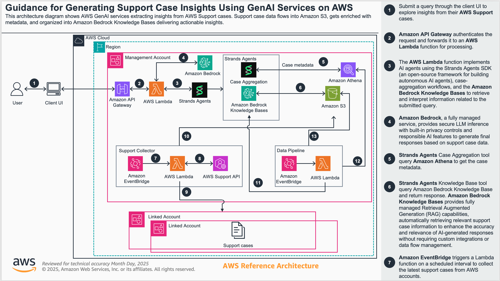
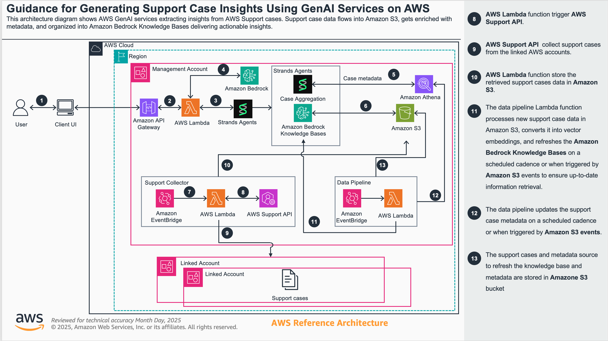

# Guidance for Generating Support Case Insights Using GenAI Services on AWS

## Table of Contents

1. [Overview](#overview)
   - [Architecture](#architecture)
   - [Cost](#cost)
2. [Prerequisites](#prerequisites)
3. [Deployment Steps](#deployment-steps)
4. [Deployment Validation](#deployment-validation)
5. [Running the Guidance](#running-the-guidance)
6. [Next Steps](#next-steps)
7. [Cleanup](#cleanup)
8. [FAQ, known issues, additional considerations, and limitations](#faq-known-issues-additional-considerations-and-limitations)
9. [Revisions](#revisions)
10. [Notices](#notices)

## Overview

This guidance optimizes operational efficiencies through Agentic AI by delivering automated support case analysis. Built using the open-source Strands SDK from AWS, this solution provides complete flexibility and control over your AI implementation - you can use any LLM you prefer, whether it's Bedrock models, any model providers, or even local models like Ollama. You can extend this solution for your organization's needs.

The solution provides access through APIs or a web interface, featuring specialized agents that deliver distinct capabilities. The architecture is completely serverless, running on Bedrock and Lambda for automatic scaling without infrastructure management. Most importantly, this is a 100% API-driven solution that can easily integrate with any platform you're already using, whether that's Slack or your own internal tools.

The Support Case Agent capability processes both structured and unstructured data from AWS support cases, performing numerical analysis using RAG and SQL agents for comprehensive operational insights. When dealing with support cases, the system handles two types of data: metadata (case ID, status, severity) for measurable statistical analysis, and conversation text for contextual understanding, providing both the story behind each case and statistical trends for data-driven decisions.

### Architecture

The following diagram illustrates an organizational structure with multiple AWS accounts, where support cases from linked accounts are pulled into the organization's main account. 





The architecture showcases modularity - you can add new agents or enhance existing ones without disrupting the overall flow. The implementation follows the [Agents as Tools](https://strandsagents.com/latest/documentation/docs/user-guide/concepts/multi-agent/agents-as-tools/) architecture pattern from Strands.

**Key Architectural Components:**

**Entry Points and Integration:**
- Users interact through web interface or directly via API calls
- All requests funnel through Amazon API Gateway with API key security
- 100% API-driven design enables integration with any platform (Slack, internal tools, etc.)

**AI Agent Orchestration:**
- API Gateway triggers Lambda functions implementing multi-agents using Strands Agents SDK
- Orchestrator agent coordinates all specialized agents based on user prompts
- Two primary specialized agents for support cases:
  - **Numerical Analysis Agent**: Handles structured data queries using Athena SQL
  - **Knowledge Base Agent**: Processes unstructured data using RAG

**Data Flow and Processing:**
- Natural language queries are translated into precise Athena SQL via Bedrock LLM
- Support case metadata collected through AWS Support API
- Data stored in S3 and made queryable through Athena for unified multi-account view
- Orchestrator synthesizes responses from all agents into comprehensive answers

**Flexibility and Control:**
- Built on open-source [Strands SDK](https://strandsagents.com/latest/documentation/docs/) for complete customization
- LLM-agnostic design - use Bedrock, any model providers, or even [local models like Ollama](https://strandsagents.com/latest/documentation/docs/user-guide/concepts/model-providers/ollama/)
- Serverless architecture on Bedrock and Lambda for automatic scaling
- Modular design allows adding new capabilities without architectural changes

The Data Collection Account refers to the central account that contains the support data in an S3 bucket after downloading from all accounts in scope. The Linked accounts refer to any accounts other than the Data Collection Account that have AWS support data - AWS support cases.

### Cost

You are responsible for the cost of the AWS services used while running this Guidance. As of 2025, the cost for running this Guidance with the default settings in the US East (N. Virginia) Region is approximately $1,324.12 per month for processing moderate traffic levels.

We recommend creating a [Budget](https://docs.aws.amazon.com/cost-management/latest/userguide/budgets-managing-costs.html) through [AWS Cost Explorer](https://aws.amazon.com/aws-cost-management/aws-cost-explorer/) to help manage costs. Prices are subject to change. For full details, refer to the pricing webpage for each AWS service used in this Guidance.

#### Estimated Cost Table

The following table provides a sample cost breakdown for deploying this Guidance with the default parameters in the US East (N. Virginia) Region for one month.

| AWS Service                  | Component                            | Usage                              | Monthly Cost [USD] |
|------------------------------|--------------------------------------|------------------------------------|--------------------|
| Amazon S3                    | Standard Storage                     | 50GB support data                  | $1.15              |
|                              | Operations (PUT, GET, etc.)          | 10,000 operations                  | $0.05              |
|                              | Data Transfer                        | 10GB                               | $0.90              |
| AWS Lambda                   | Agent Function (10GB memory)         | 3,000 invocations                  | $60.00             |
|                              | Metadata Function                    | 3,000 invocations                  | $60.00             |
|                              | Collector Function                   | 3,000 invocations                  | $60.00             |
|                              | Support Collector (Member accounts)  | 3,000 invocations per account      | $60.00             |
| Amazon Bedrock               | Claude 4 Sonnet Model                | 10,000 input/output tokens         | $648.00            |
|                              | Embedding Model (Titan)              | 10M tokens                         | $1.00              |
| Amazon OpenSearch Serverless | Vector Storage                       | 10GB knowledge base/1 OCU          | $350.64            |
| Amazon API Gateway           | REST API Calls                       | 5,000 calls                        | $17.50             |
| Amazon Cognito               | User Pool                            | 50 monthly active users            | $5.00              |
| Amazon Athena                | Query Processing                     | 100GB scanned/1000 queries         | $48.83             |
| Amazon EventBridge           | Custom Events                        | 5,000 events                       | $0.10              |
|                              | EventBridge Scheduler                | 100 executions                     | $0.00              |
| AWS Secrets Manager          | Secret Storage                       | 2 secrets                          | $0.80              |
| AWS WAF (Optional)           | Web ACL Rules                        | 1M requests                        | $9.60              |
| CloudWatch Logs              | Log Storage                          | 5GB                                | $2.50              |
| AWS Support API              | API Calls                            | Included                           | $0.00              |
| **Total**                    |                                      |                                    | **$1,324.12/month**|

## Prerequisites

### Required Tools

- Node.js (v18 or later)
- Python 3.12
- AWS CLI configured with appropriate permissions
- AWS CDK CLI
- An S3 bucket for storing support case data

### AWS CDK Bootstrap

If you're using AWS CDK for the first time, bootstrap your account:

```bash
cdk bootstrap
```

## Deployment Steps

This section outlines the key components of the solution and their deployment process.

### A. Optira Core

This section outlines the key components of the Optira solution. 

### A. Optira Core

The solution has Optira Core that is deployed in a central Data Collection account. This contains core agents that can be deployed via CDK. It contains:
 - AI Agents powered by Amazon Bedrock and Strands SDK - running in central (Data Collection) account
 - Amazon Bedrock Knowledge Base
 - API Gateway that abstracts the AI agents
 - Extension to the Data Pipeline that updates metadata and Knowledge Base in the central account when the data collection S3 bucket is updated

The deployment process is detailed in the [Optira Core Deployment](./optira-core/README.md) guide, located in the `optira-core` subdirectory. This guide covers the steps to set up the required AWS resources.

### B. AWS Support Collector Module - Data Pipeline

The solution includes a data collection module to retrieve the necessary AWS support data.

The [Optira AWS Support Collection - Data Pipeline](./support_collector/README.md) guide, located in the `support_collector` subdirectory, outlines the steps to deploy the AWS Lambda functions and EventBridge resources required to collect and upload AWS Support Cases to an Amazon S3 bucket. This collected data can then be leveraged by Optira AI Agents to provide insights and remediations.

### C. Optira Web

Node.js React Web interface secured via Cognito. The architecture and deployment process is detailed in the [Optira Web Deployment](./optira-web/README.md) guide, located in the `optira-web` subdirectory.

## Deployment Validation

1. Verify CloudFormation stack status:
   - Open AWS CloudFormation console
   - Check that all stacks show "CREATE_COMPLETE"

2. Validate deployed resources:
   - API Gateway endpoint is accessible
   - Lambda functions are deployed
   - Bedrock Knowledge Base is created
   - S3 bucket contains support case data

3. Test API connectivity:
   - Retrieve API key from deployment output
   - Send test query to API Gateway endpoint

## Running the Guidance

### Query the Agent

Send POST requests to the deployed Lambda function:

```json
{
  "query": "What is total count of RDS issues?"
}
```

### API Gateway Access

You can also access the agent via API Gateway. The API Gateway URL is provided in the CDK deployment output, and you'll need to retrieve the API key value:

```bash
# Get the API key value using the API key ID from deployment output
aws apigateway get-api-key --api-key <API-KEY-ID> --include-value --region us-west-2

# Example API call
curl -X POST \
  'https://your-api-gateway-url.execute-api.{AWS_REGION}.amazonaws.com/prod/prompt' \
  -H 'x-api-key: YOUR_API_KEY_VALUE' \
  -H 'Content-Type: application/json' \
  -d '{"query": "how many support cases entered, give me a breakdown year by year?"}'
```

**Note:** Replace the API Gateway URL with the value from your CDK deployment output (`ApiUrl`), and use the API key ID from the deployment output (`ProdApiKeyId`) to retrieve the actual API key value.

### Sample Output

Sample output using REST API and Web Application.

#### A. Using REST API


#### B. Using Web Application


## Next Steps

1. Extend the solution with additional agents:
   - Add new specialized agents for different data sources
   - Implement custom tools using Strands SDK
   - Configure agents for specific use cases

2. Integrate with existing platforms:
   - Connect to Slack for conversational queries
   - Integrate with internal dashboards
   - Set up automated reporting workflows

3. Optimize and monitor:
   - Monitor Lambda execution metrics
   - Optimize Knowledge Base retrieval
   - Implement caching strategies for frequently asked queries

## Cleanup

To remove all deployed resources:

```bash
cd optira-core/es-optira && cdk destroy
cd ../es-optira-kb && cdk destroy
cd ../es-optira-collector && cdk destroy
cd ../es-optira-data-pipeline && cdk destroy
```

Manual cleanup steps:
- Empty and delete S3 buckets created for support data
- Delete Cognito User Pool (if using Optira Web)
- Remove CloudWatch log groups
- Delete Athena database and tables

## FAQ, known issues, additional considerations, and limitations

### Known Issues

1. API Gateway integration timeout is limited to 29 seconds by default - requires quota increase to 180 seconds
2. Initial Lambda cold start may take longer for first request
3. Knowledge Base synchronization may take time after data updates

### Additional Considerations

- **Multi-agent architecture**: Uses Strands SDK for orchestrating specialized agents
- **LLM-agnostic design**: Compatible with any LLM provider including Bedrock, OpenAI, or local models
- **Serverless architecture**: Automatic scaling without infrastructure management
- **API-driven**: Can integrate with any platform or tool
- **Data privacy**: All data remains within your AWS account

### Limitations

1. **AWS Support API access required**: Must have appropriate AWS Support plan
2. **Region availability**: Depends on Amazon Bedrock service availability
3. **Knowledge Base limitations**: Subject to Bedrock Knowledge Base quotas
4. **Query complexity**: Complex analytical queries may require longer processing time
5. **Multi-account setup**: Requires proper IAM permissions across accounts

For any feedback, questions, or suggestions, please contact your AWS Technical Account Managers (TAMs).

## Revisions

### [1.0.0] - 2025

- Initial release
- Multi-agent architecture using Strands SDK
- Support for numerical analysis and RAG-based queries
- API Gateway and web interface access
- Multi-account support case collection

## Notices

Customers are responsible for making their own independent assessment of the information in this Guidance. This Guidance: (a) is for informational purposes only, (b) represents AWS current product offerings and practices, which are subject to change without notice, and (c) does not create any commitments or assurances from AWS and its affiliates, suppliers or licensors. AWS products or services are provided "as is" without warranties, representations, or conditions of any kind, whether express or implied. AWS responsibilities and liabilities to its customers are controlled by AWS agreements, and this Guidance is not part of, nor does it modify, any agreement between AWS and its customers.
