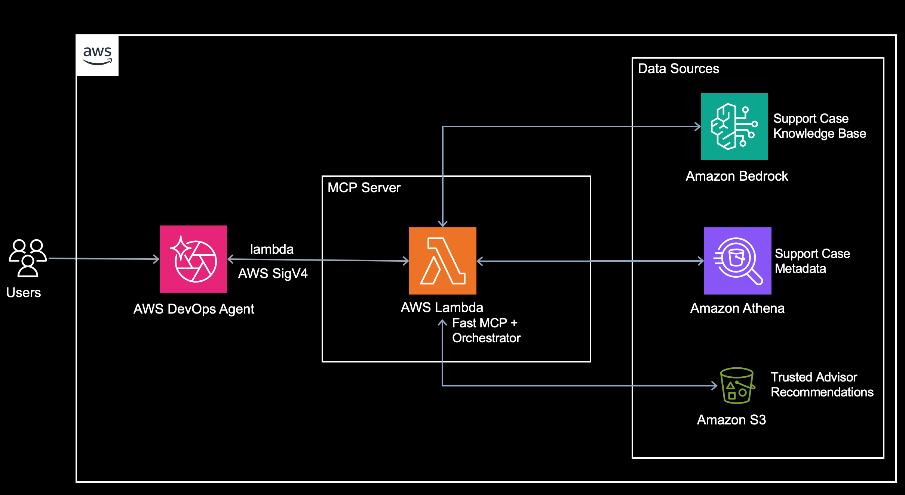

# Optira MCP Server — AWS DevOps Agent Onboarding Guide

Exposes Optira's AWS support-case and Trusted Advisor insights as a
[Model Context Protocol](https://modelcontextprotocol.io) (MCP) server so it can
be registered as a **capability provider** in **AWS DevOps Agent**. The agent
can then answer support-case questions (counts, lists, root cause, resolution,
communication history) and pull Trusted Advisor recommendations to remediate,
during its investigations.

This package is **standalone and opt-in**. It does not modify any other Optira
component — it reuses the same S3 bucket, Athena table, and Knowledge Base the
shared data components produce.

## Choose your interface: REST API or MCP

Optira offers two independent front doors over the same shared data foundation.
They both provide **support-case insights**, but they are **not** identical: the
MCP server additionally exposes **Trusted Advisor recommendations**, which the
REST API does not. Deploy whichever fits your consumers — or both. They do not
depend on each other.

| Interface | Package | Best for | Capabilities | Entry point |
|---|---|---|---|---|
| **REST API** | `../es-optira` | Apps/scripts calling an HTTPS API with an API key | Support-case insights only | `POST /prompt` (API Gateway + agent Lambda) |
| **MCP server** | `es-optira-mcp` (this package) | AWS DevOps Agent and other MCP hosts | Support-case insights **+ Trusted Advisor recommendations** | `get_support_insights` and `get_trusted_advisor_recommendations` tools over Streamable HTTP (SigV4) |

> Trusted Advisor is currently available **only** through the MCP server. If you
> need Trusted Advisor remediation data (flagged resources), use the MCP
> interface.

Both sit on top of the same **shared data foundation**:

- `../es-optira-collector` — pulls support cases (Support API) and Trusted
  Advisor recommendations (Trusted Advisor API) into S3 (`support-cases/` and
  `ta/`).
- `../es-optira-kb` — creates the Bedrock Knowledge Base and writes the
  `optira/knowledge-base-id` secret.
- `../es-optira-data-pipeline` — builds the `case_metadata` Athena table and
  triggers KB ingestion.

The data foundation is required for either interface. The REST API and MCP
stacks are independent — deploy either, both, or just the MCP server on top of
the data foundation.

---

## Contents

1. [Choose your interface: REST API or MCP](#choose-your-interface-rest-api-or-mcp)
2. [How it works](#how-it-works)
3. [Tools](#tools)
4. [Prerequisites](#prerequisites)
5. [Step 1 — Deploy the MCP server](#step-1--deploy-the-mcp-server)
6. [Step 2 — Register the MCP server in AWS DevOps Agent](#step-2--register-the-mcp-server-in-aws-devops-agent)
7. [Step 3 — Add the server to an Agent Space](#step-3--add-the-server-to-an-agent-space)
8. [Step 4 — Guide the agent with knowledge](#step-4--guide-the-agent-with-knowledge)
9. [Step 5 — Ask the agent](#step-5--ask-the-agent)
10. [Configuration reference](#configuration-reference)
11. [Troubleshooting](#troubleshooting)
12. [Security](#security)
13. [Cleanup](#cleanup)
14. [Disclaimer](#disclaimer)

---

## How it works



- AWS DevOps Agent requires the **Streamable HTTP** transport and one of its
  supported auth methods; this server uses **AWS SigV4**, validated by the
  Lambda Function URL's `AWS_IAM` auth type.
- A **non-VPC Lambda** reaches Bedrock/Athena/KB/S3 over the AWS network — no NAT
  gateway, no ALB, and no always-on compute, so there is no idle cost when it is
  not in use. You still pay per use (Lambda invocations, Bedrock inference,
  Athena queries, S3, CloudWatch).
- `get_support_insights` runs the **Strands orchestrator**, which decides per
  question whether to use Athena or the Knowledge Base (or both), mirroring the
  es-optira agent Lambda.
- `get_trusted_advisor_recommendations` **bypasses the orchestrator** and reads
  the collector's `ta/` objects straight from S3 — Trusted Advisor data is not
  in Athena or the Knowledge Base.

## Tools

The server exposes two purpose-built, read-only tools. Each maps to a distinct
task so the agent can't pick the wrong data source.

| MCP tool | What it does | Returns |
|---|---|---|
| `get_support_insights` | Runs the Optira orchestrator over any natural-language **support-case** question. Uses **Athena** for exact counts/lists/facts and the **Bedrock Knowledge Base** for narrative, combining both when needed. | `{ "answer": "<synthesized text>" }` |
| `get_trusted_advisor_recommendations` | Lists actionable **Trusted Advisor** recommendations (warning/error) collected across the org's accounts, including the exact **flagged resources** to remediate. Reads the collector's `ta/` objects from S3. | `{ count, total_available, truncated, recommendations: [ { account_id, check_id, status, description, flagged_resources_count, flagged_resources } ] }` |

`get_trusted_advisor_recommendations` optionally scopes to one account via
`account_id`.

---

## Prerequisites

Complete **all** of the following before deploying and onboarding. They are
grouped so you can check them off in order. Verification commands assume the
target Region (default `us-east-1`).

### A. Shared data foundation is deployed (required)

The MCP server does not create data — it reads what the shared data components
produce (`../es-optira-collector`, `../es-optira-kb`, and
`../es-optira-data-pipeline`, described above). Deploy all of them at once by
running `../deploy.sh` from `optira-core/`. Then confirm each of these exists in
the target account/Region:

- [ ] **Support data S3 bucket** containing case JSON under `support-cases/`.
  ```bash
  aws s3 ls s3://<support_bucket_name>/support-cases/ --region <region>
  ```
- [ ] **Athena metadata table** `optira_database.case_metadata` is populated.
  ```bash
  aws athena start-query-execution \
    --query-string "SELECT COUNT(*) FROM optira_database.case_metadata" \
    --query-execution-context Database=optira_database \
    --result-configuration OutputLocation=s3://<support_bucket_name>/results/ \
    --region <region>
  ```
- [ ] **Knowledge Base id secret** `optira/knowledge-base-id` holds an **active**
  KB id (JSON key `knowledge_base_id`).
  ```bash
  aws secretsmanager get-secret-value --secret-id optira/knowledge-base-id \
    --query SecretString --output text --region <region>
  ```

  If any are missing, run `../deploy.sh` from `optira-core/` to deploy the data
  foundation before continuing.

### B. AWS account and Bedrock access (required)

- [ ] **AWS Support plan**: Business, Enterprise On-Ramp, or Enterprise (the
  Support API that feeds the data requires it).
- [ ] **Amazon Bedrock model access** enabled in the Region for the models the
  tool uses: `global.anthropic.claude-opus-4-7` (or your configured
  `BEDROCK_MODEL_ID`) and `amazon.titan-embed-text-v2:0` (embeddings).
- [ ] You are deploying into the **same account and Region** as the core Optira
  solution and the Knowledge Base.

### C. AWS DevOps Agent is set up (required)

- [ ] **AWS DevOps Agent** is enabled/onboarded in the account.
- [ ] You have an **Agent Space**, and it has a **primary AWS account**
  associated with it (SigV4 MCP registration validation uses the primary
  account's role — without it, association fails).

### D. Local tooling and versions (required)

- [ ] **AWS CLI v2**, configured with credentials for the target account
  (`aws sts get-caller-identity`).
- [ ] **Python 3.12** (the Lambda runtime; the packaging step builds 3.12 ARM64
  wheels) — `python3 --version`.
- [ ] **Node.js 18+** and the **AWS CDK CLI** (`npx cdk --version`; `deploy.sh`
  uses `npx cdk`).
- [ ] **Docker is NOT required** — dependencies are packaged as ARM64 wheels
  into a Lambda layer by `bin/package_for_lambda.py`.

### E. Deployer IAM permissions (required)

The identity running the deploy needs permission to create/update the stack's
resources, at minimum: CloudFormation, IAM (roles/policies), Lambda (+layers and
Function URL), and read access to the `optira/knowledge-base-id` secret. Admin or
a power-user role in a non-production account is simplest; scope down for
production.

### F. CDK bootstrap (required, one-time per account/Region)

- [ ] The target account/Region is **CDK bootstrapped**:
  ```bash
  npx cdk bootstrap aws://<account_id>/<region>
  ```
  (`deploy.sh` also runs `cdk bootstrap` for you.)

---

## Step 1 — Deploy the MCP server

The `infra/` folder contains a Python CDK stack, `OptiraMcpServerStack`. Make
sure the data foundation is deployed first (see Prerequisites A).

```bash
# from optira-core/es-optira-mcp
./deploy.sh --bucket <support_bucket_name> [--region <region>]
```

`<support_bucket_name>` is the **same** S3 bucket the rest of Optira uses (the
one holding `support-cases/` and where Athena writes `results/`).

### Capture the stack outputs

After deploy, note these CloudFormation outputs (also printed by `deploy.sh`):

| Output | Use in registration |
|---|---|
| `McpEndpointUrl` | The endpoint to register, e.g. `https://<url-id>.lambda-url.<region>.on.aws/mcp` |
| `DevOpsAgentInvokeRoleArn` | The IAM role AWS DevOps Agent assumes to SigV4-sign requests |
| `SigV4Region` | The Region to enter for SigV4 signing |
| `SigV4Service` | `lambda` |

You can also fetch them later:

```bash
aws cloudformation describe-stacks --stack-name OptiraMcpServerStack \
  --query 'Stacks[0].Outputs' --output table --region <region>
```

---

## Step 2 — Register the MCP server in AWS DevOps Agent

Registration is **account-level** (shared across Agent Spaces in the account).

1. Open the **AWS DevOps Agent** console → **Capability Providers**.
2. Find **MCP Server** under available providers and choose **Register**.
3. **MCP server details**:
   - **Name**: `<your-mcp-server-name>` — choose a name and remember it; you
     must use the exact same name in the agent knowledge (Step 4).
   - **Endpoint URL**: the `McpEndpointUrl` output (must end in `/mcp`)
   - **Description** (optional): "Optira AWS support-case insights"
   - Leave **Dynamic Client Registration** unchecked (not used for SigV4).
   - Leave **private connection** unchecked (the endpoint is the public Lambda
     Function URL, gated by SigV4/IAM).
   - Choose **Next**.
4. **Authentication method**: select **AWS SigV4** → **Next**.
5. **Authorization configuration**:
   - **IAM role**: choose **Use an existing role** and select the
     `DevOpsAgentInvokeRoleArn` from the stack outputs. Its trust policy already
     allows the `aidevops.amazonaws.com` service principal (with
     `aws:SourceAccount` / `aws:SourceArn` confused-deputy conditions) and it
     has `lambda:InvokeFunctionUrl` **and** `lambda:InvokeFunction` on the
     function.
   - **AWS Region**: the `SigV4Region` value (e.g. `us-east-1`).
   - **Service Name**: `lambda`.
   - Leave **Custom Headers** empty.
   - Choose **Next**.
6. **Review and submit** → **Submit**. DevOps Agent validates the connection by
   calling the endpoint; on success the server is registered at the account
   level.

> The endpoint URL will appear in CloudTrail — that's expected.

---

## Step 3 — Add the server to an Agent Space

1. In the console, open your **Agent Space** → **Capabilities** tab.
2. In the **MCP Servers** section, choose **Add**.
3. Select the registered `<your-mcp-server-name>` server.
4. Tool allowlist: choose **Select specific tools** and enable the tools you
   want the agent to use:
   - **`get_support_insights`** — support-case Q&A.
   - **`get_trusted_advisor_recommendations`** — Trusted Advisor findings +
     flagged resources for remediation.
5. Choose **Add**.

The tools are read-only, so DevOps Agent treats them as non-mutating actions and
runs them without an approval prompt.

---

## Step 4 — Guide the agent with knowledge

Add a short knowledge entry to your Agent Space so the agent reliably picks the
right Optira tool for each kind of question. In the DevOps Agent console, add
the following to your Agent Space knowledge / instructions / Chat AGENTS.md:

```
If any ask about support cases, use MCP <your-mcp-server-name> server tool
get_support_insights to get an answer.

If any ask about trusted advisor recommendation, use MCP <your-mcp-server-name>
server tool get_trusted_advisor_recommendations to get an answer.
```

Notes:
- Replace `<your-mcp-server-name>` with the exact **Name** you used when
  registering the MCP server in Step 2 — the two must match.
- Keep the tool names exact: `get_support_insights` and
  `get_trusted_advisor_recommendations`.
- This guidance is optional but recommended — it steers routing so support-case
  questions go to `get_support_insights` and Trusted Advisor questions go to
  `get_trusted_advisor_recommendations`.

---

## Step 5 — Ask the agent

From the Agent Space (or any MCP client connected to your Agent Space), ask
support-case questions. Examples:

- "How many support cases do we have, and list the case ids by account?" →
  complete list (answered via Athena).
- "What was the root cause and resolution for case <case-id>?" →
  narrative (answered from the Knowledge Base).
- "Summarize the DevOps Agent S3-bucket cases from the last month." → combined.

For **Trusted Advisor remediation**, the agent uses
`get_trusted_advisor_recommendations`:

- "What Trusted Advisor issues need remediation across our accounts?"
- "List Trusted Advisor findings for account 123456789012 and the resources to fix."

---

## Configuration reference

All settings come from environment variables on the Lambda (defaults mirror the
CDK stack; the stack sets these for you):

| Variable | Default | Notes |
|---|---|---|
| `AWS_REGION` | `us-east-1` | Set automatically in Lambda; falls back to `AWS_DEFAULT_REGION` locally |
| `BEDROCK_MODEL_ID` | `global.anthropic.claude-opus-4-7` | Model for SQL generation and KB synthesis |
| `KB_SECRET_NAME` | `optira/knowledge-base-id` | Secrets Manager secret the Lambda reads the KB id from **at runtime** (JSON key `knowledge_base_id`) |
| `KNOWLEDGEBASE_ID` | _(unset)_ | Optional override. If set, it wins over the secret |
| `ATHENA_DATABASE` | `optira_database` | |
| `ATHENA_OUTPUT_S3` | `s3://<bucket>/results/` | Athena query-results location |
| `SUPPORT_DATA_BUCKET` | _(from `ATHENA_OUTPUT_S3`)_ | Bucket the Trusted Advisor tool reads `ta/` objects from; the stack sets it |
| `KB_MAX_RESULTS` | `5` (stack sets `25`) | KB chunks retrieved per query |
| `MAX_QUERY_EXECUTION_TIME` | `300` | Athena poll timeout (seconds) |
| `SYSTEM_PROMPT` | _(built-in, matches es-optira)_ | Drives orchestrator routing between Athena and the KB |

> The KB id is resolved from the `optira/knowledge-base-id` secret **at
> runtime** (once per Lambda cold start), not baked at deploy time. If the
> Knowledge Base is recreated with a new id, the server picks it up on the next
> cold start — no redeploy needed. This also means the MCP server can be
> deployed **before or after** the Knowledge Base exists.

---

## Troubleshooting

| Symptom | Likely cause | Fix |
|---|---|---|
| Registration/validation fails: "requires a primary account association" | The Agent Space has no primary AWS account | Associate a primary account whose role can `lambda:InvokeFunctionUrl`, then retry |
| `403 Forbidden` from the Function URL during registration | The invoke role is missing `lambda:InvokeFunction` (needs **both** `InvokeFunctionUrl` and `InvokeFunction`), or the resource-based permission is absent | Redeploy so the role grants both actions and the function has the `AWS_IAM` `AWS::Lambda::Permission`; confirm Region = `SigV4Region` and Service = `lambda` |
| `{"message":"Internal server error"}` on the MCP handshake | Function error before a JSON-RPC reply | Check `OptiraMcpServer` CloudWatch logs; verify env vars are set |
| Athena error "Unable to verify/create output bucket" | Wrong bucket, or missing `s3:GetBucketLocation` | Deploy with the correct `--bucket`; the stack grants `GetBucketLocation`/`ListBucket` |
| Athena "no such database/table" or empty results | Core solution not deployed / metadata pipeline not run | Ensure `case_metadata` is populated (run `../es-optira-data-pipeline`) |
| KB answers say a case "isn't in the sources" or under-counts | RAG retrieves only a bounded set of chunks | Ask via `get_support_insights` (routes counts/lists to Athena); the KB is for narrative, not enumeration |
| Long queries time out | The Lambda function timeout (300s) was exceeded | Keep queries bounded; if needed, raise the function `timeout` in `infra/app.py` (Function URLs allow up to 15 min) |

Reference: [AWS DevOps Agent — Connecting MCP Servers](https://docs.aws.amazon.com/devopsagent/latest/userguide/configuring-integrations-and-knowledge-connecting-mcp-servers.html).

---

## Security

- **Production (DevOps Agent):** access is gated by **SigV4 + IAM** on the
  Lambda Function URL (`AWS_IAM` auth type). Only principals that can assume
  `DevOpsAgentInvokeRoleArn` (the AWS DevOps Agent service, constrained by
  account/ARN conditions) and hold `lambda:InvokeFunctionUrl` +
  `lambda:InvokeFunction` can invoke it.
- **Least privilege:** the Lambda role is scoped to Bedrock, Athena, Glue, the
  support S3 bucket, and read access to the `optira/knowledge-base-id` secret.
  Both exposed tools are read-only.

---

## Cleanup

The MCP server is a standalone stack, so tear it down on its own — this does not
touch the shared data foundation or the REST API:

```bash
aws cloudformation delete-stack --stack-name OptiraMcpServerStack --region <region>
```

This removes the Lambda, its Function URL, the layer, and the two IAM roles.
The support S3 bucket, Athena table, Knowledge Base, and the
`optira/knowledge-base-id` secret are owned by the data foundation and are left
intact.

---

## Disclaimer

The sample code provided in this solution is for educational purposes only. Users should thoroughly test and validate the solution before deploying it in a production environment.
